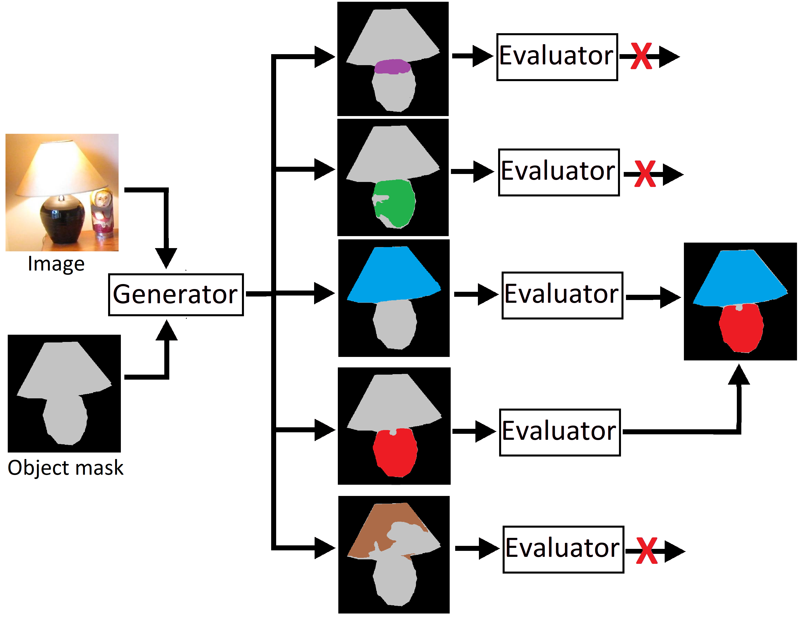

# Generator evaluator selector (GES) net for class agnostic part segmentation
## See parent folder for usage instructions  

The system is a combination of two nets: a generator net and an evaluator net. The system receives an image and a mask of an object as input
and segment all the parts of this object.  This is class agnostic and works even for unfamiliar objects that did not appear in the training set.
Based on two nets, one generate a proposal for object parts, and another evaluates the proposals.

For more details see this [document](https://arxiv.org/pdf/1908.09108.pdf) 

Train model can be downloaded from [here](https://drive.google.com/file/d/1eA_zc9GtXbGMjqp7Ok64a7yWrZFq1RFu/view?usp=sharing)

## Requirements
This network was run with Python 3.7  [Anaconda](https://www.anaconda.com/download/) package and [Pytorch 1](https://pytorch.org/) and opencv. The training was done using Nvidia GTX 1080.

# Running segmentation
# Running the net:
1. Download the pre-trained system from [here](https://drive.google.com/file/d/1eA_zc9GtXbGMjqp7Ok64a7yWrZFq1RFu/view?usp=sharing) or train using the instruction in training
2. Go to RunSegmentation.py and run (to run on example data).

## Parameters:
Trained_model_path = path to trained model

InImage = path input image

InObjectMask = path object mask region as a binary mask

OutAnnotationFile = Output annotation file path

See Example inputs for example inputs

# Training 
See PointerSegmentation and evaluator folders for instruction training individual nets.  

# Evaluation
1. Train net or download pre-trained system [here](https://drive.google.com/file/d/1eA_zc9GtXbGMjqp7Ok64a7yWrZFq1RFu/view?usp=sharing)
2. Generate training data using the PointerSegmentation folder.
3. open EVALUATE_GES.py
4. Set path to the generated evaluation data:
   
   MaskDir =  Annotation folder 
   
   ImageDir =  Image folder
   
   See Example Folder for data format.
5. Run script.
